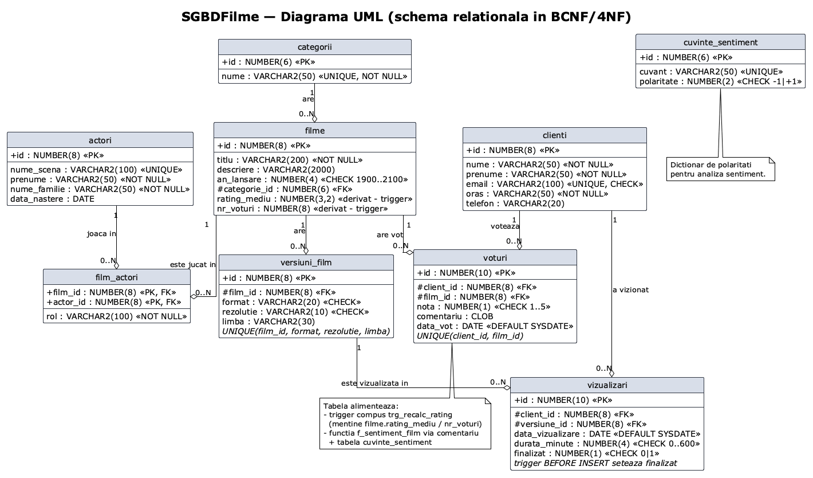
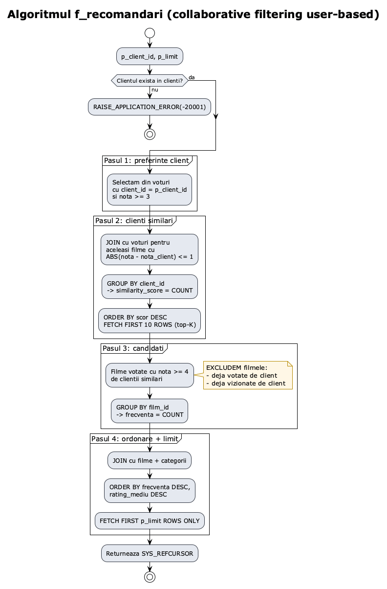
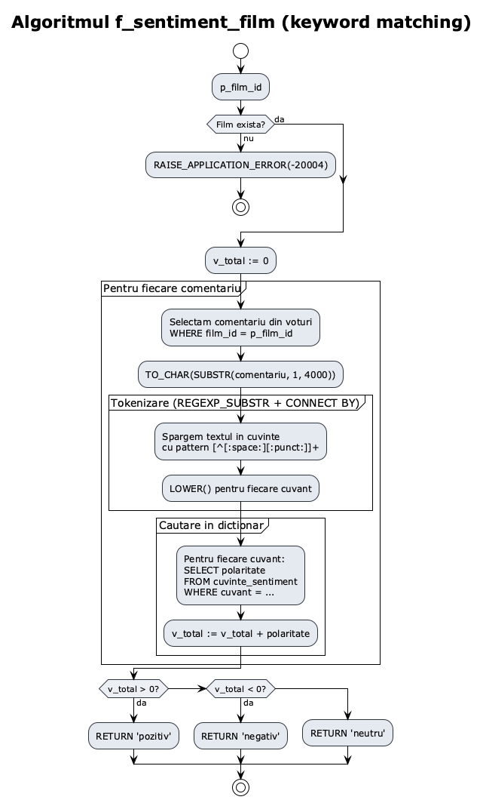
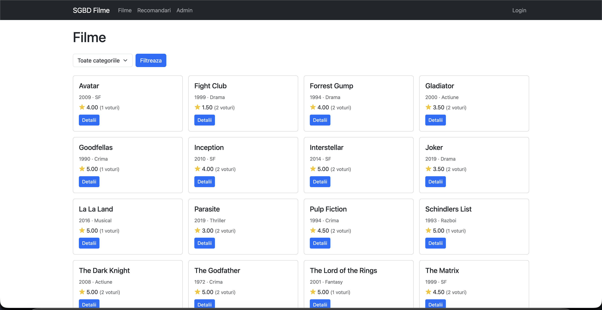
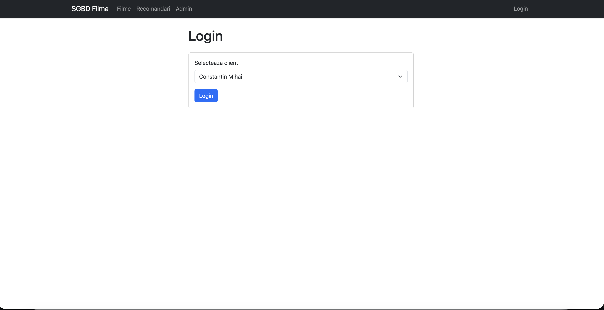
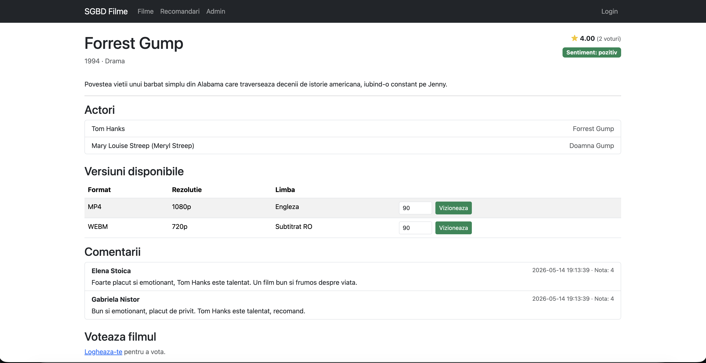
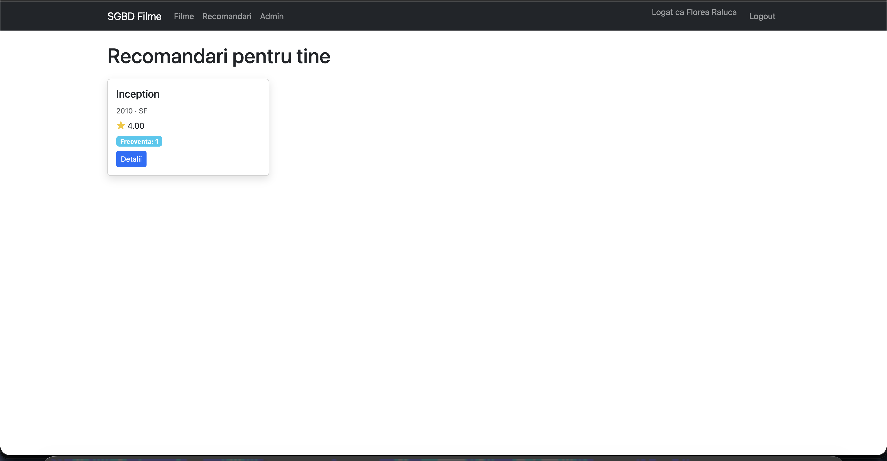
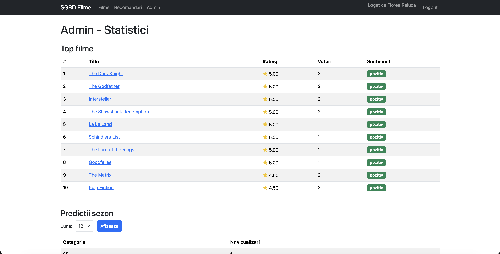
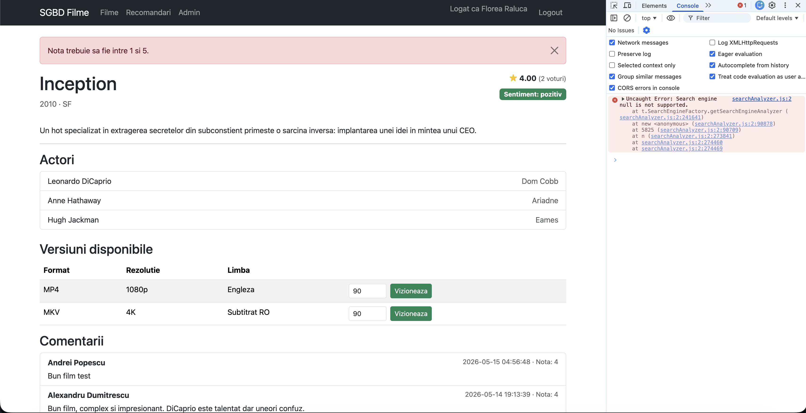
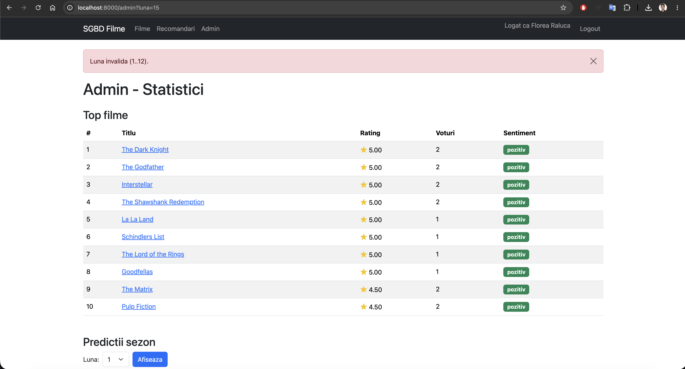

## 1. Introducere

Acest referat prezintă proiectul realizat în cadrul materiei PSGBD, o aplicație web pentru administrarea unei platforme de vizualizare de filme. Sistemul permite gestionarea filmelor, a versiunilor în care acestea sunt oferite, a clienților, a actorilor, a istoricului vizualizărilor, a voturilor cu comentarii și include algoritmi de tip non-CRUD implementați în PL/SQL: recomandări personalizate pe baza similarității între clienți, analiză de sentiment a comentariilor și predicții sezoniere.

Stackul tehnic ales:

- **Bază de date:** Oracle Database 21c Express Edition (rulată în Docker prin imaginea `gvenzl/oracle-xe:21-slim-faststart`).
- **Limbaj server BD:** PL/SQL.
- **Backend aplicație:** Python 3.10+ cu microframeworkul Flask 3.0.
- **Driver bază de date:** `oracledb` 2.2 în modul „thin" (nu necesită Oracle Instant Client instalat la nivel de sistem).
- **Frontend:** HTML5 + Bootstrap 5 (din CDN) + JavaScript vanilla.

Conform cerinței explicite, nu s-a folosit niciun ORM (Object-Relational Mapping). Toate apelurile către baza de date se fac prin SQL/PL-SQL direct, prin proceduri și funcții stocate într-un pachet PL/SQL dedicat.

---

## 2. Cerințe de business identificate

Pornind de la scenariul de bază din enunțul proiectului, au fost identificate următoarele cerințe de business:

### CB1. Catalog de filme
Aplicația trebuie să afișeze un catalog cu toate filmele disponibile, cu posibilitatea de filtrare după categorie. Pentru fiecare film se afișează titlul, anul lansării, categoria și ratingul mediu calculat din voturile clienților.

### CB2. Versiuni multiple per film
Un film poate exista în sistem în mai multe versiuni distincte, definite de combinația (format video, rezoluție, limbă). De exemplu, același film poate fi disponibil în MP4 1080p Engleză, MKV 4K Engleză și MP4 720p Subtitrat RO.

### CB3. Distribuție actori
Pentru fiecare film se cunoaște distribuția (actorii care joacă în el). Un actor poate apărea în mai multe filme și un film are mai mulți actori. Pentru fiecare pereche (film, actor) se reține rolul jucat.

### CB4. Conturi de clienți
Utilizatorii platformei se autentifică ca clienți. Pentru fiecare client se rețin date personale (nume, prenume), date de contact (email, telefon, oraș). Email-ul trebuie să fie unic la nivelul aplicației.

### CB5. Istoric vizualizări
Pentru fiecare interacțiune de tip „vizionare" se înregistrează: clientul care vizionează, versiunea selectată, data, durata urmărită și un flag de „finalizat" care se setează automat (vezi CB10).

### CB6. Voturi și comentarii
Un client poate vota un film o singură dată (nota între 1 și 5) și opțional poate adăuga un comentariu text. Votul poate fi modificat ulterior. Ratingul mediu al filmului este recalculat automat după fiecare schimbare.

### CB7. Recomandări personalizate
Aplicația oferă fiecărui client recomandări de filme noi, bazate pe gusturile altor clienți cu preferințe similare. Algoritmul nu trebuie să recomande filme deja vizionate sau votate de client.

### CB8. Analiză de sentiment a comentariilor
Pentru fiecare film se calculează o clasificare a sentimentului general („pozitiv" / „neutru" / „negativ") bazat pe cuvintele-cheie din comentariile clienților.

### CB9. Predicții sezoniere
Sistemul oferă, în interfața de administrare, top categoriile cele mai vizionate într-o anumită lună din an, pentru a sprijini deciziile de marketing și promovare.

### CB10. Marcare automată „finalizat"
O vizualizare cu durata urmărită >= 80 minute este considerată automat „finalizată" (acest prag e o euristică de business pentru un film standard). Sub 80 de minute este considerată parțială.

### CB11. Top filme
Interfața de administrare arată un top al filmelor după rating mediu, pentru filmele care au cel puțin un vot.

---

## 3. Schema bazei de date și normalizare

### 3.1. Pornirea de la o singură relație universală

Conform metodologiei studiate, plecăm de la o singură relație universală care conține toate atributele identificate din cerințele de business:

```
R(id_film, titlu_film, descriere, an_lansare, nume_categorie,
  id_actor, nume_scena, prenume_actor, nume_familie_actor, data_nastere_actor, rol,
  id_versiune, format, rezolutie, limba,
  id_client, nume_client, prenume_client, email, oras, telefon,
  id_vizualizare, data_vizualizare, durata_minute, finalizat,
  id_vot, nota, comentariu, data_vot,
  cuvant_sentiment, polaritate)
```

### 3.2. Identificarea dependențelor funcționale (FD)

Pornind de la cerințele de business identificate, deducem următoarele dependențe funcționale:

- **FD1:** `id_film → titlu_film, descriere, an_lansare, nume_categorie` (un film are un titlu, o descriere, un an de lansare și aparține unei singure categorii).
- **FD2:** `nume_categorie → nume_categorie` (categoria este unic identificată prin nume — UNIQUE constraint).
- **FD3:** `id_actor → nume_scena, prenume_actor, nume_familie_actor, data_nastere_actor`.
- **FD4:** `nume_scena → id_actor` (numele de scenă este unic).
- **FD5:** `id_versiune → id_film, format, rezolutie, limba` (o versiune aparține unui singur film și are o singură combinație format/rezoluție/limbă).
- **FD6:** `id_film, format, rezolutie, limba → id_versiune` (combinația este unică pentru un film — UNIQUE compus).
- **FD7:** `id_client → nume_client, prenume_client, email, oras, telefon`.
- **FD8:** `email → id_client` (email-ul este unic).
- **FD9:** `id_vizualizare → id_client, id_versiune, data_vizualizare, durata_minute, finalizat`.
- **FD10:** `id_vot → id_client, id_film, nota, comentariu, data_vot`.
- **FD11:** `id_client, id_film → id_vot` (un client poate vota un film doar o singură dată).
- **FD12:** `id_film, id_actor → rol` (un actor are un rol bine definit într-un film).
- **FD13:** `cuvant_sentiment → polaritate` (un cuvânt are o singură polaritate).

### 3.3. Dependențe multivaluate (MVD)

Identificăm și o dependență multivaluată importantă:

- **MVD1:** `id_film →→ id_actor | id_versiune` — într-o singură relație universală, listarea actorilor este independentă de listarea versiunilor. Această MVD trebuie eliminată prin descompunere în 4NF.

### 3.4. Aplicarea algoritmului de descompunere BCNF / 4NF

Aplicăm algoritmul de descompunere conform metodologiei studiate. Pentru fiecare FD `X → Y` în care `X` nu este superkey, descompunem relația în:

- `R1 = π(X ∪ Y)(R)` cu cheia `X`
- `R2 = πR-Y(R)` cu vechea cheie

Aplicat iterativ, ajungem la următoarele relații, fiecare în BCNF (toate determinantele sunt chei candidat) și 4NF (fără MVD-uri non-triviale):

1. `categorii(id, nume)` — chei candidat: `id`, `nume`.
2. `filme(id, titlu, descriere, an_lansare, categorie_id)` — cheie: `id`.
3. `actori(id, nume_scena, prenume, nume_familie, data_nastere)` — chei candidat: `id`, `nume_scena`.
4. `film_actori(film_id, actor_id, rol)` — cheie: `(film_id, actor_id)`. Această tabelă rezolvă atât M:N între filme și actori, cât și MVD1.
5. `versiuni_film(id, film_id, format, rezolutie, limba)` — chei candidat: `id`, `(film_id, format, rezolutie, limba)`.
6. `clienti(id, nume, prenume, email, oras, telefon)` — chei candidat: `id`, `email`.
7. `vizualizari(id, client_id, versiune_id, data_vizualizare, durata_minute, finalizat)` — cheie: `id`.
8. `voturi(id, client_id, film_id, nota, comentariu, data_vot)` — chei candidat: `id`, `(client_id, film_id)`.
9. `cuvinte_sentiment(id, cuvant, polaritate)` — chei candidat: `id`, `cuvant`.

Atributele *derivate* `filme.rating_mediu` și `filme.nr_voturi` au fost adăugate ulterior pe `filme` din motive de performanță și menținute consistente prin trigger compus (vezi secțiunea 5). Aceste atribute nu încalcă BCNF deoarece sunt determinate funcțional de `id` (cheia primară), însă reprezintă o denormalizare controlată — alegere documentată conștient pentru a evita un agregat scump (`AVG`, `COUNT`) la fiecare afișare.

### 3.5. Diagrama E/A (UML)

Diagrama UML a schemei relaționale (generată automat din sursa PlantUML `docs/diagrams/schema.puml`):

{ width=100% }

**Descrierea entităților și asocierilor:**

| Entitate | Atribute principale | Cardinalitate |
|---|---|---|
| `categorii` | id, nume | 1 categorie - N filme |
| `filme` | id, titlu, descriere, an_lansare, rating_mediu (derivat), nr_voturi (derivat) | 1 film - N versiuni; M filme - N actori; 1 film - N voturi |
| `actori` | id, nume_scena, prenume, nume_familie, data_nastere | M actori - N filme |
| `film_actori` | film_id, actor_id, rol | tabelă de asociere M:N |
| `versiuni_film` | id, format, rezolutie, limba | 1 versiune - N vizualizări |
| `clienti` | id, nume, prenume, email, oras, telefon | 1 client - N vizualizări; 1 client - N voturi |
| `vizualizari` | id, data_vizualizare, durata_minute, finalizat | tabelă tranzacțională |
| `voturi` | id, nota, comentariu, data_vot | UNIQUE(client_id, film_id) |
| `cuvinte_sentiment` | id, cuvant, polaritate | dicționar de suport |

**Transcrierea asocierilor între instanțe:**

- O instanță din `categorii` este asociată cu zero, una sau mai multe instanțe din `filme` prin atributul `filme.categorie_id`. Asocierea este 1:N (totală pe partea de film: fiecare film aparține obligatoriu unei categorii; parțială pe partea de categorie: pot exista categorii fără filme momentan).
- O instanță din `filme` este asociată cu zero sau mai multe instanțe din `actori` prin tabela `film_actori`. Asocierea este M:N. Atributul `rol` calificare asocierea (un actor poate juca un rol distinct în fiecare film).
- O instanță din `filme` este asociată cu zero sau mai multe instanțe din `versiuni_film`. Combinația `(film_id, format, rezolutie, limba)` este unică, deci nu pot exista două versiuni identice ale aceluiași film.
- O instanță din `clienti` este asociată cu zero sau mai multe instanțe din `vizualizari` (istoric vizionări) și zero sau una instanță din `voturi` per film.

### 3.6. Constrângeri aplicate (toate cele 5 tipuri)

Conform cerinței PSGBD, schema folosește toate cele 5 tipuri de constrângeri prevăzute de standardul SQL:

| Tip constrângere | Exemplu din schemă | Motivație |
|---|---|---|
| **PRIMARY KEY** | `CONSTRAINT pk_filme PRIMARY KEY (id)` | Identificare unică a fiecărui film; index automat pentru join-uri. |
| **FOREIGN KEY** | `CONSTRAINT fk_voturi_film FOREIGN KEY (film_id) REFERENCES filme(id) ON DELETE CASCADE` | Integritate referențială. Cascade pe `voturi` și `film_actori` deoarece dacă un film este șters, voturile și asocierile cu actorii nu mai au sens. NU cascade pe `vizualizari` (istoric tranzacțional - blochează ștergerea). |
| **UNIQUE** | `CONSTRAINT uq_voturi_pereche UNIQUE (client_id, film_id)` | Un client poate vota un film doar o singură dată. Alte UNIQUE: `email` client, `nume_scena` actor, `nume` categorie, combinație versiune. |
| **NOT NULL** | `nota NUMBER(1) NOT NULL` | Câmpurile obligatorii din punct de vedere business (titlu, email, nota etc.). |
| **CHECK** | `CONSTRAINT ck_voturi_nota CHECK (nota BETWEEN 1 AND 5)` | Validări la nivel de coloană. Alte exemple: an_lansare între 1900 și 2100, format IN ('MP4', 'MKV', 'WEBM', 'AVI'), rezolutie IN ('480p', '720p', '1080p', '4K'), polaritate IN (-1, 1), durata_minute între 0 și 600, finalizat IN (0, 1), email LIKE '%@%.%'. |

---

## 4. Schema fizică - cod SQL cu explicații

### 4.1. Crearea tabelelor și secvențelor (extras din `sql/01_schema.sql`)

S-a folosit auto-increment-ul prin **secvențe Oracle** (nu coloane `IDENTITY`, pentru a fi portabil pe Oracle XE 11g+). Fiecare tabelă cu cheie primară surogată are o secvență dedicată cu prefixul `seq_`.

```sql
WHENEVER SQLERROR EXIT FAILURE

CREATE TABLE filme (
    id            NUMBER(8)       NOT NULL,
    titlu         VARCHAR2(200)   NOT NULL,
    descriere     VARCHAR2(2000),
    an_lansare    NUMBER(4)       NOT NULL,
    categorie_id  NUMBER(6)       NOT NULL,
    rating_mediu  NUMBER(3,2)     DEFAULT 0,
    nr_voturi     NUMBER(8)       DEFAULT 0,
    CONSTRAINT pk_filme PRIMARY KEY (id),
    CONSTRAINT fk_filme_categorie FOREIGN KEY (categorie_id) REFERENCES categorii(id),
    CONSTRAINT ck_filme_an CHECK (an_lansare BETWEEN 1900 AND 2100),
    CONSTRAINT ck_filme_rating CHECK (rating_mediu BETWEEN 0 AND 5)
);

CREATE SEQUENCE seq_filme START WITH 1 INCREMENT BY 1 NOCACHE;
```

**Explicații:**

- `NUMBER(8)` pentru ID-uri permite până la 99,999,999 înregistrări — suficient pentru un demo dar fără să fie risipa de a folosi `NUMBER(38)`.
- `VARCHAR2(200)` pentru titlu — limitare conformă cu majoritatea titlurilor de film reale.
- `DEFAULT 0` pe `rating_mediu` și `nr_voturi` — film nou creat fără voturi încă.
- `NOCACHE` la secvențe — pentru a evita „găuri" în ID-uri la restart container (irelevant pentru demo, dar profesional).
- `WHENEVER SQLERROR EXIT FAILURE` la începutul scriptului — dacă o instrucțiune eșuează, scriptul oprește execuția imediat (foarte util la rulare batch în SQL*Plus).

### 4.2. Folosirea secvențelor la insert

```sql
INSERT INTO filme (id, titlu, descriere, an_lansare, categorie_id)
VALUES (seq_filme.NEXTVAL, 'Inception', '...', 2010, 5);
```

Alternativa modernă ar fi `GENERATED BY DEFAULT AS IDENTITY` (Oracle 12c+), dar secvența explicită este abordarea „clasică" pe care studiile de baze de date o predau și permite un control mai fin asupra valorii (ex. resetare la 1, salt manual).

---

## 5. Triggere

Schema include două triggere care automatizează reguli de business la nivelul serverului BD.

### 5.1. `trg_recalc_rating` - trigger compus

**Scop:** menține `filme.rating_mediu` și `filme.nr_voturi` sincronizate automat la orice modificare a tabelei `voturi`.

**De ce trigger compus?** Un trigger AFTER ROW pe `voturi` care încearcă să citească tot din `voturi` ar întâlni eroarea **ORA-04091 „table is mutating"**. Soluția standard este un *compound trigger* care colectează ID-urile filmelor afectate în secțiunea AFTER EACH ROW și apoi face actualizările bulk în AFTER STATEMENT.

```sql
CREATE OR REPLACE TRIGGER trg_recalc_rating
FOR INSERT OR UPDATE OR DELETE ON voturi
COMPOUND TRIGGER

    TYPE t_film_ids IS TABLE OF NUMBER INDEX BY PLS_INTEGER;
    v_filme t_film_ids;

    AFTER EACH ROW IS
    BEGIN
        IF INSERTING OR UPDATING THEN
            v_filme(v_filme.COUNT + 1) := :NEW.film_id;
        END IF;
        IF DELETING OR UPDATING THEN
            v_filme(v_filme.COUNT + 1) := :OLD.film_id;
        END IF;
    END AFTER EACH ROW;

    AFTER STATEMENT IS
        v_avg   NUMBER;
        v_count NUMBER;
    BEGIN
        FOR i IN 1 .. v_filme.COUNT LOOP
            SELECT NVL(AVG(nota), 0), COUNT(*)
              INTO v_avg, v_count
              FROM voturi
             WHERE film_id = v_filme(i);

            UPDATE filme
               SET rating_mediu = v_avg,
                   nr_voturi    = v_count
             WHERE id = v_filme(i);
        END LOOP;
    END AFTER STATEMENT;

END trg_recalc_rating;
/
SHOW ERRORS
```

**Note:**
- Colecția `v_filme` este o tabelă PL/SQL indexată (`INDEX BY PLS_INTEGER`) — structură eficientă pentru acumulare în memorie.
- `NVL(AVG(nota), 0)` protejează de cazul în care toate voturile sunt șterse (AVG pe set gol = NULL).
- `IF DELETING OR UPDATING THEN ... v_filme(...) := :OLD.film_id` — important pentru cazul ștergerii unui vot: trebuie să recalculăm pentru filmul VECHI, nu pentru `:NEW.film_id`.
- `SHOW ERRORS` la final — în caz de eroare de compilare a corpului, se afișează imediat detaliile.

### 5.2. `trg_marcheaza_finalizat` - trigger BEFORE INSERT

**Scop:** la inserarea unei vizualizări noi, setează automat flagul `finalizat` în funcție de durata urmărită.

```sql
CREATE OR REPLACE TRIGGER trg_marcheaza_finalizat
BEFORE INSERT ON vizualizari
FOR EACH ROW
BEGIN
    IF :NEW.durata_minute >= 80 THEN
        :NEW.finalizat := 1;
    ELSE
        :NEW.finalizat := 0;
    END IF;
END trg_marcheaza_finalizat;
/
SHOW ERRORS
```

**Note:**
- Trigger BEFORE INSERT permite modificarea valorii `:NEW` *înainte* ca aceasta să fie scrisă în tabelă.
- Pragul de 80 minute reflectă un film standard de durată redusă. Pentru un sistem real, pragul ar fi de exemplu 80% din durata totală a filmului — am simplificat pentru demo.

---

## 6. Pachet PL/SQL `pkg_filme`

Toată logica de server este încapsulată într-un pachet PL/SQL. Avantaje:
- Cod organizat și reutilizabil.
- Reducerea numărului de roundtrip-uri client-server (un singur apel returnează un cursor cu rezultatele).
- Posibilitatea de a folosi `RAISE_APPLICATION_ERROR` pentru excepții business cu coduri (-20001..-20006) bine definite.

### 6.1. Funcții oferite

Pachetul expune 8 funcții care returnează `SYS_REFCURSOR` (sau scalar) și 2 proceduri:

| Nume | Tip | Descriere |
|---|---|---|
| `f_film_detalii(id)` | function | Detalii film + categorie |
| `f_actori_film(id)` | function | Lista actori + rol per film |
| `f_versiuni_film(id)` | function | Versiunile disponibile |
| `f_comentarii_film(id)` | function | Comentariile + voturile |
| `f_top_filme(limit)` | function | Top N filme după rating |
| `f_recomandari(client_id, limit)` | function | **Algoritm recomandări** |
| `f_sentiment_film(id)` | function | **Analiză sentiment** |
| `f_predictie_sezon(luna)` | function | Top categorii pe lună |
| `p_inregistreaza_vizualizare(client_id, versiune_id, durata)` | procedure | Insert + validări |
| `p_voteaza(client_id, film_id, nota, comentariu)` | procedure | Upsert vot prin MERGE |

### 6.2. Algoritmul de recomandări (collaborative filtering simplu)

Diagrama de flux a algoritmului (sursă: `docs/diagrams/recomandari_flow.puml`):

{ width=75% }


Este implementat în funcția `f_recomandari` și folosește 4 CTE-uri (WITH-clauses) pentru claritate:

```sql
FUNCTION f_recomandari(p_client_id IN NUMBER, p_limit IN NUMBER DEFAULT 10)
    RETURN SYS_REFCURSOR
IS
    v_cur   SYS_REFCURSOR;
    v_count NUMBER;
BEGIN
    -- Validare: clientul există
    SELECT COUNT(*) INTO v_count FROM clienti WHERE id = p_client_id;
    IF v_count = 0 THEN
        RAISE_APPLICATION_ERROR(-20001, 'Client inexistent');
    END IF;

    OPEN v_cur FOR
        WITH preferinte_client AS (
            -- Pasul 1: filmele preferate de clientul curent (nota >= 3)
            SELECT film_id, nota FROM voturi
             WHERE client_id = p_client_id AND nota >= 3
        ),
        clienti_similari AS (
            -- Pasul 2: alti clienti cu gusturi asemanatoare (delta nota <= 1)
            SELECT v.client_id, COUNT(*) AS similarity_score
              FROM voturi v
              JOIN preferinte_client p ON p.film_id = v.film_id
             WHERE v.client_id <> p_client_id
               AND ABS(v.nota - p.nota) <= 1
             GROUP BY v.client_id
             ORDER BY similarity_score DESC
             FETCH FIRST 10 ROWS ONLY  -- top-K = 10 clienti similari
        ),
        filme_vazute AS (
            SELECT DISTINCT vf.film_id
              FROM vizualizari viz
              JOIN versiuni_film vf ON vf.id = viz.versiune_id
             WHERE viz.client_id = p_client_id
        ),
        filme_votate AS (
            SELECT film_id FROM voturi WHERE client_id = p_client_id
        ),
        candidati AS (
            -- Pasul 3: filme apreciate (nota >= 4) de clientii similari,
            -- excludem filmele deja vazute/votate de clientul curent
            SELECT v.film_id, COUNT(*) AS frecventa
              FROM voturi v
              JOIN clienti_similari cs ON cs.client_id = v.client_id
             WHERE v.nota >= 4
               AND v.film_id NOT IN (SELECT film_id FROM filme_votate)
               AND v.film_id NOT IN (SELECT film_id FROM filme_vazute)
             GROUP BY v.film_id
        )
        -- Pasul 4: rezultatul final
        SELECT f.id, f.titlu, f.an_lansare, c.nume AS categorie,
               f.rating_mediu, cnd.frecventa
          FROM candidati cnd
          JOIN filme f      ON f.id = cnd.film_id
          JOIN categorii c  ON c.id = f.categorie_id
         ORDER BY cnd.frecventa DESC, f.rating_mediu DESC
         FETCH FIRST p_limit ROWS ONLY;

    RETURN v_cur;
END f_recomandari;
```

**Explicații de design:**

1. **Pasul 1 (preferințe client):** filmele cu `nota >= 3` sunt considerate „apreciate" de client. Acest prag a fost ales conservator — voturile sub 3 indică nemulțumire și nu trebuie folosite ca semnal pozitiv.
2. **Pasul 2 (clienți similari):** alți clienți care au votat aceleași filme cu un delta de cel mult 1 punct sunt considerați „similari". Numărul de filme cu vot apropiat dă scorul de similaritate. Limităm la top 10 clienți similari (parametru de complexitate algoritmică - `K` standard în collaborative filtering).
3. **Pasul 3 (candidați):** filme votate cu nota mare (>= 4) de clienții similari, **excluzând** filmele deja vizionate sau votate de utilizatorul curent — nu vrem să recomandăm ce a văzut deja.
4. **Pasul 4 (ordonare):** filmele candidat sunt ordonate după frecvența cu care au fost recomandate de clienții similari (signal de consens), apoi după rating mediu (signal de calitate generală).

Aceasta este o variantă simplificată a algoritmului **user-based collaborative filtering** folosit în sisteme reale (Netflix, Amazon). Pentru o versiune cu acuratețe mai mare, s-ar putea ponderare scorul cu `similarity_score`-ul propriu fiecărui client similar (de exemplu media ponderată în loc de simplu COUNT). Am ales abordarea simplă pentru lizibilitate și demo.

### 6.3. Algoritmul de analiză sentiment

Implementat în funcția `f_sentiment_film`. Strategia: pentru fiecare comentariu al filmului, se tokenizează textul în cuvinte folosind expresii regulate, fiecare cuvânt este căutat în tabela `cuvinte_sentiment`, polaritățile sunt sumate, iar rezultatul final este clasificat în `'pozitiv' / 'neutru' / 'negativ'`.

Diagrama de flux a algoritmului (sursă: `docs/diagrams/sentiment_flow.puml`):

{ width=75% }


```sql
FUNCTION f_sentiment_film(p_film_id IN NUMBER) RETURN VARCHAR2
IS
    v_count NUMBER;
    v_total NUMBER := 0;
    v_text  VARCHAR2(4000);
BEGIN
    SELECT COUNT(*) INTO v_count FROM filme WHERE id = p_film_id;
    IF v_count = 0 THEN
        RAISE_APPLICATION_ERROR(-20004, 'Film inexistent');
    END IF;

    FOR rec IN (SELECT comentariu FROM voturi
                 WHERE film_id = p_film_id AND comentariu IS NOT NULL) LOOP

        v_text := TO_CHAR(SUBSTR(rec.comentariu, 1, 4000));

        FOR tok IN (
            SELECT LOWER(REGEXP_SUBSTR(v_text, '[^[:space:][:punct:]]+', 1, LEVEL)) AS cuvant
              FROM dual
            CONNECT BY REGEXP_SUBSTR(v_text, '[^[:space:][:punct:]]+', 1, LEVEL) IS NOT NULL
        ) LOOP
            FOR s IN (SELECT polaritate FROM cuvinte_sentiment WHERE cuvant = tok.cuvant) LOOP
                v_total := v_total + s.polaritate;
            END LOOP;
        END LOOP;
    END LOOP;

    IF v_total > 0 THEN RETURN 'pozitiv';
    ELSIF v_total < 0 THEN RETURN 'negativ';
    ELSE RETURN 'neutru';
    END IF;
END f_sentiment_film;
```

**Note tehnice:**

- `REGEXP_SUBSTR(text, '[^[:space:][:punct:]]+', 1, LEVEL)` + `CONNECT BY LEVEL <= ...` este o tehnică Oracle clasică pentru a sparge un text în cuvinte. Patternul exclude spațiile și semnele de punctuație.
- `LOWER()` asigură matching case-insensitive. Tabela `cuvinte_sentiment` are toate cuvintele în minuscule.
- `SUBSTR(rec.comentariu, 1, 4000)` truncare conștientă la primele 4000 de caractere — limitarea VARCHAR2 SQL în PL/SQL. Pentru comentarii foarte lungi (peste 4000 caractere) ar fi nevoie de procesare în chunks, dar pentru un demo nu este necesar.

### 6.4. Procedura `p_voteaza` cu MERGE (upsert)

Procedura inserează un vot nou sau actualizează votul existent al clientului pentru filmul respectiv, folosind comanda SQL `MERGE` (UPSERT):

```sql
PROCEDURE p_voteaza(p_client_id IN NUMBER, p_film_id IN NUMBER,
                    p_nota IN NUMBER, p_comentariu IN CLOB DEFAULT NULL)
IS
    v_count NUMBER;
BEGIN
    SELECT COUNT(*) INTO v_count FROM clienti WHERE id = p_client_id;
    IF v_count = 0 THEN
        RAISE_APPLICATION_ERROR(-20001, 'Client inexistent');
    END IF;

    SELECT COUNT(*) INTO v_count FROM filme WHERE id = p_film_id;
    IF v_count = 0 THEN
        RAISE_APPLICATION_ERROR(-20004, 'Film inexistent');
    END IF;

    IF p_nota IS NULL OR p_nota < 1 OR p_nota > 5 THEN
        RAISE_APPLICATION_ERROR(-20003, 'Nota invalida');
    END IF;

    MERGE INTO voturi v
    USING (SELECT p_client_id AS client_id, p_film_id AS film_id FROM dual) src
       ON (v.client_id = src.client_id AND v.film_id = src.film_id)
     WHEN MATCHED THEN
        UPDATE SET v.nota = p_nota, v.comentariu = p_comentariu, v.data_vot = SYSDATE
     WHEN NOT MATCHED THEN
        INSERT (id, client_id, film_id, nota, comentariu, data_vot)
        VALUES (seq_voturi.NEXTVAL, p_client_id, p_film_id, p_nota, p_comentariu, SYSDATE);

    COMMIT;
END p_voteaza;
```

`MERGE` permite operația atomică INSERT-sau-UPDATE într-un singur statement, ceea ce este mai elegant decât abordarea „verifică dacă există, dacă da UPDATE, altfel INSERT" (care în plus ar fi vulnerabilă la race condition între SELECT și INSERT).

---

## 7. Aplicația web Flask

### 7.1. Structura proiectului

```
SGBDFilme/
├── sql/                 # toate scripturile DB
│   ├── 01_schema.sql
│   ├── 02_triggers.sql
│   ├── 03_package_spec.sql
│   ├── 04_package_body.sql
│   ├── 05_populate.sql
│   └── 99_drop_all.sql
├── app/
│   ├── __init__.py
│   ├── app.py           # rutele Flask
│   ├── db.py            # conexiune și helperi BD
│   ├── static/
│   │   └── style.css
│   └── templates/       # Jinja2
│       ├── base.html
│       ├── index.html
│       ├── login.html
│       ├── film.html
│       ├── recomandari.html
│       └── admin.html
├── requirements.txt
├── .env.example
└── README.md
```

### 7.2. Modul de conexiune `app/db.py`

Conexiunea la baza de date Oracle se face prin driverul `oracledb` 2.x în mod „thin" (fără Oracle Instant Client). Modulul `db.py` expune 4 funcții helper:

```python
import os
import oracledb
from dotenv import load_dotenv

load_dotenv()

# Fetch CLOB/BLOB columns ca string-uri Python direct, nu LOB-uri lazy.
# Fără asta, citirea unui CLOB după închiderea conexiunii dă DPY-1001.
oracledb.defaults.fetch_lobs = False

def get_conn():
    return oracledb.connect(
        user=os.getenv("ORACLE_USER"),
        password=os.getenv("ORACLE_PASSWORD"),
        dsn=os.getenv("ORACLE_DSN"))

def call_func_cursor(func_name, *args):
    """Apeleaza o functie PL/SQL care returneaza SYS_REFCURSOR.
       Returneaza listă de dict-uri."""
    with get_conn() as conn:
        with conn.cursor() as cur:
            ref = cur.var(oracledb.DB_TYPE_CURSOR)
            placeholders = ",".join(f":{i+2}" for i in range(len(args)))
            sql = f"BEGIN :1 := pkg_filme.{func_name}({placeholders}); END;"
            cur.execute(sql, [ref, *args])
            rc = ref.getvalue()
            cols = [c[0].lower() for c in rc.description]
            return [dict(zip(cols, row)) for row in rc]
```

**Note:**

- `oracledb.defaults.fetch_lobs = False` este crucial: fără el, coloanele CLOB (cum este `voturi.comentariu`) sunt returnate ca obiecte `LOB` lazy care necesită conexiunea originală deschisă pentru a fi citite. Cum în template-ul Jinja CLOB-ul este accesat după ce funcția `call_func_cursor` a închis conexiunea (`with ... as conn` se termină), apare eroarea `DPY-1001: not connected to database`. Setarea face ca LOB-urile să fie citite *eager*, ca string-uri Python obișnuite.
- `with get_conn() as conn: with conn.cursor() as cur` — context manager-urile garantează închiderea corectă a resurselor chiar și în caz de excepție.

### 7.3. Rutele Flask și prinderea excepțiilor PL/SQL

Aplicația expune 8 rute:

| Rută | Metodă | Scop |
|---|---|---|
| `/` | GET | Catalog filme cu filtru categorie |
| `/login` | GET, POST | Selectare client (demo) |
| `/logout` | GET | Resetează sesiunea |
| `/film/<id>` | GET | Detalii film |
| `/vizualizeaza` | POST | Înregistrare vizualizare |
| `/voteaza` | POST | Vot + comentariu |
| `/recomandari` | GET | Recomandări personalizate |
| `/admin` | GET | Statistici |

Pentru prinderea excepțiilor business ridicate din PL/SQL prin `RAISE_APPLICATION_ERROR(-20001..-20006, ...)`, aplicația folosește un dicționar de mapping și un helper unic:

```python
_ORA_MESSAGES = {
    "ORA-20001:": "Client inexistent.",
    "ORA-20002:": "Versiune indisponibilă.",
    "ORA-20003:": "Nota trebuie sa fie intre 1 si 5.",
    "ORA-20004:": "Film inexistent.",
    "ORA-20005:": "Luna invalida (1..12).",
    "ORA-20006:": "Durata invalida.",
}

def parse_oracle_error(e):
    msg = str(e)
    for code, friendly in _ORA_MESSAGES.items():
        if code in msg:
            return friendly
    return "Eroare baza de date: " + msg.split("\n")[0]
```

Și apoi în orice rută care apelează BD:

```python
try:
    db.call_proc("p_voteaza", session["client_id"], film_id, nota, comentariu)
    flash("Vot inregistrat.", "success")
except oracledb.DatabaseError as e:
    flash(parse_oracle_error(e), "danger")
```

**Excepții prinse efectiv în aplicație** (depășesc cerința minimă de 2):

1. `ORA-20001` — Client inexistent (în `/vizualizeaza`, `/voteaza`, `/recomandari`).
2. `ORA-20002` — Versiune indisponibilă (în `/vizualizeaza`).
3. `ORA-20003` — Notă invalidă (în `/voteaza`).
4. `ORA-20004` — Film inexistent (în `/film/<id>`, `/voteaza`).
5. `ORA-20005` — Lună invalidă (în `/admin`).
6. `ORA-20006` — Durată invalidă (în `/vizualizeaza`).

---

## 8. Prezentarea interfeței

Capturile de mai jos sunt din aplicația rulată local (Flask + Oracle XE 21 în Docker). Toate paginile folosesc Bootstrap 5 încărcat din CDN, deci stilul este uniform și responsive.

### 8.1. Pagina principală — catalogul de filme

{ width=100% }

Catalogul afișează toate filmele sub formă de carduri, cu titlul, anul, categoria, ratingul mediu și numărul de voturi. Filtrarea se face prin parametrul `?categorie=X` în URL, gestionat de o ramură condițională în handler-ul Python.

### 8.2. Login

{ width=85% }

Pentru simplitate, autentificarea se face prin selectarea unui client din dropdown (demo). Într-un sistem de producție s-ar adăuga parolă și sesiune autentificată corespunzător.

### 8.3. Detalii film

{ width=100% }

Pagina de detalii integrează **toate** funcțiile PL/SQL relevante pentru un film:
- `f_film_detalii(id)` — header
- `f_actori_film(id)` — secțiunea Actori
- `f_versiuni_film(id)` — tabelul Versiuni
- `f_comentarii_film(id)` — secțiunea Comentarii
- `f_sentiment_film(id)` — badge-ul de sentiment

Formularul de vot apelează procedura `p_voteaza` prin POST către `/voteaza`. Butonul „Vizionează" de pe fiecare rând de versiune apelează `p_inregistreaza_vizualizare` prin POST către `/vizualizeaza`.

### 8.4. Recomandări personalizate

{ width=100% }

Această pagină apelează `pkg_filme.f_recomandari(client_id, 10)` și afișează rezultatul. Badge-ul „Frecvență" arată câți clienți similari au apreciat fiecare film recomandat — un indicator de încredere al recomandării.

### 8.5. Pagina admin — statistici

{ width=100% }

Pagina admin integrează:
- `f_top_filme(10)` — top 10 filme.
- `f_sentiment_film(id)` — sentiment per film (afișat în coloana ultimului tabel).
- `f_predictie_sezon(luna)` — top categorii într-o lună selectată.

---

## 9. Comportament la excepții (demo)

Pentru a demonstra prinderea excepțiilor PL/SQL în aplicația-client, sunt prezentate două scenarii reproductibile:

### 9.1. Demo `ORA-20003` (Notă invalidă)

{ width=100% }

În condiții normale (nota 1-5), constraint-ul `CHECK ck_voturi_nota` ar prinde valoarea. PL/SQL-ul ridică `ORA-20003` proactiv din `p_voteaza`. Aplicația Flask prinde `oracledb.DatabaseError`, identifică codul prin `parse_oracle_error()` și afișează un mesaj prietenos.

### 9.2. Demo `ORA-20005` (Luna invalidă)

{ width=100% }

---

## 10. Date de populare

Scriptul `sql/05_populate.sql` populează toate tabelele cu date realiste:

| Tabelă | Nr. înregistrări | Date |
|---|---|---|
| categorii | 16 | Acțiune, Comedie, Dramă, Horror, SF, ... |
| filme | 18 | Inception, The Matrix, Interstellar, The Dark Knight, ... |
| actori | 20 | DiCaprio, Bale, Pitt, Hanks, ... |
| film_actori | 25 | Asociere realistă (DiCaprio → Inception → Cobb etc.) |
| versiuni_film | 30 | Combinații realiste de format/rezoluție/limbă |
| clienti | 16 | Nume românești, orașe (Iași, București, Cluj, ...) |
| vizualizari | 30 | Vizionări spread pe luni multiple |
| voturi | 30 | Cu comentarii **deliberat sentiment-rich** |
| cuvinte_sentiment | 30 | 15 pozitive + 15 negative, în română |

Comentariile la voturi conțin intenționat cuvinte din tabela `cuvinte_sentiment` pentru a face algoritmul de sentiment să producă rezultate semnificative. Exemplu:

```sql
INSERT INTO voturi (...) VALUES (...,
    'Excelent film, scenariu impresionant si actori talentati. Recomand!');
INSERT INTO voturi (...) VALUES (...,
    'Prost, slab si plictisitor. Dezamagit total, scenariu ridicol.');
```

---

## 11. Comenzi de rulare

### 11.1. Pornire bază de date Oracle XE 21 (Docker)

```bash
docker run -d --name oracle-xe \
  -p 1521:1521 \
  -e ORACLE_PASSWORD=Welcome1 \
  -e APP_USER=sgbdfilme \
  -e APP_USER_PASSWORD=sgbdfilme \
  -v oracle-xe-data:/opt/oracle/oradata \
  gvenzl/oracle-xe:21-slim-faststart
```

### 11.2. Rulare scripturi SQL

```bash
docker cp sql/. oracle-xe:/tmp/sgbdsql/
docker exec -it oracle-xe sqlplus sgbdfilme/sgbdfilme@localhost:1521/XEPDB1
# in SQL*Plus:
@/tmp/sgbdsql/01_schema.sql
@/tmp/sgbdsql/02_triggers.sql
@/tmp/sgbdsql/03_package_spec.sql
@/tmp/sgbdsql/04_package_body.sql
@/tmp/sgbdsql/05_populate.sql
```

### 11.3. Pornire aplicație Flask

```bash
python3 -m venv venv
source venv/bin/activate
pip install -r requirements.txt
cp .env.example .env  # editează cu credențialele
python -m app.app
# → http://localhost:5000
```

---

## 12. Concluzii

Proiectul îndeplinește toate cerințele rubrice-ului PSGBD:

| Cerință | Realizare |
|---|---|
| Minim 5 tabele | DA 9 tabele |
| Minim 15 rânduri/tabel | DA 16-30 rânduri |
| Aplicație web cu GUI | DA Flask + Bootstrap 5 |
| Apelare proceduri/funcții PL/SQL | DA Pachet `pkg_filme` cu 10 rutine |
| Minim 2 triggere | DA trg_recalc_rating (compus) + trg_marcheaza_finalizat |
| Minim 2 excepții PL/SQL prinse | DA 6 coduri ORA-20001..-20006 |
| Script auto creare + populare | DA sql/01..05 + sql/99_drop_all |
| Algoritmi non-CRUD în PL/SQL | DA Recomandări (collaborative filtering), sentiment, predicții |
| Secvențe pentru auto-increment | DA 8 secvențe |
| Toate 5 tipuri de constrângeri | DA PK, FK, UNIQUE, NOT NULL, CHECK |
| Schemă în BCNF | DA Normalizare documentată |
| Fără ORM | DA Driver `oracledb` direct, raw SQL/PL-SQL |
| Commit-uri granulare GitHub | DA 14+ commit-uri |

**Aspecte cu valoare adăugată** dincolo de cerințele minime:
- Trigger compus (pattern avansat pentru a evita ORA-04091).
- Algoritm de recomandări inspirat din user-based collaborative filtering real.
- Tokenizare textuală prin `REGEXP_SUBSTR + CONNECT BY LEVEL` (tehnică Oracle clasică).
- MERGE statement pentru upsert atomic la voturi.
- Configurarea `fetch_lobs = False` ca soluție elegantă la o problemă subtilă de durată de viață a obiectelor LOB.

**Limitări asumate conștient:**
- Autentificarea este simplificată (selectare client din dropdown) — adecvat pentru demo, dar nu pentru producție.
- Algoritmul de sentiment lucrează doar cu primele 4000 caractere din comentariu (limită VARCHAR2 SQL în PL/SQL).
- CTE `clienti_similari` este capped la top 10 prin alegere conștientă a parametrului `K` din collaborative filtering.

---

## Anexe

### Anexa A. Cuprins fișiere SQL

- `sql/01_schema.sql` — definirea tabelelor, secvențelor, constrângerilor și indecșilor.
- `sql/02_triggers.sql` — cele 2 triggere.
- `sql/03_package_spec.sql` — specificația pachetului `pkg_filme`.
- `sql/04_package_body.sql` — implementarea funcțiilor și procedurilor.
- `sql/05_populate.sql` — date de test.
- `sql/99_drop_all.sql` — script de reset.

### Anexa B. Linkuri și resurse

- Repository GitHub: https://github.com/FII-PRACTICA-SGBD/laboratoare-b1-b2-b3-e1-e2-e3-CristiMachine25
- Documentație Oracle PL/SQL: https://docs.oracle.com/en/database/oracle/oracle-database/21/lnpls/
- Driver Python oracledb: https://python-oracledb.readthedocs.io/
- Bootstrap 5: https://getbootstrap.com/docs/5.3/
- Flask: https://flask.palletsprojects.com/
